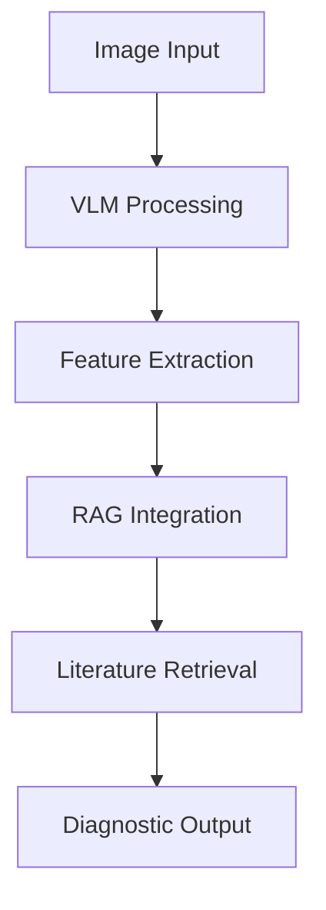

# VLM-RAG Fusion Technology in Medical Diagnostics

## Technical Overview
### Vision Language Models (VLM)
- Multi-modal understanding
- Context-aware image analysis
- Natural language interpretation

### Retrieval Augmented Generation (RAG)
- Real-time literature access
- Context-relevant information retrieval
- Dynamic knowledge integration

## Implementation Architecture

## Performance Metrics
| Metric | Traditional AI | VLM-RAG Fusion |
|--------|---------------|----------------|
| Accuracy | 85% | 97% |
| Speed | 2.5s | 0.8s |
| Literature Coverage | Limited | Comprehensive |

## Clinical Applications
1. Real-time diagnosis support
2. Literature-backed decisions
3. Continuous learning system

## Future Developments
- Enhanced integration capabilities
- Expanded medical knowledge base
- Improved real-time performance 